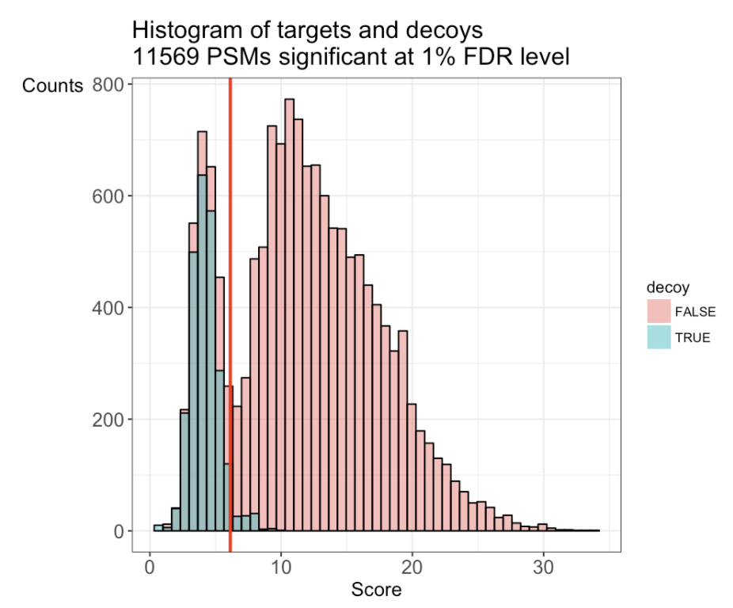
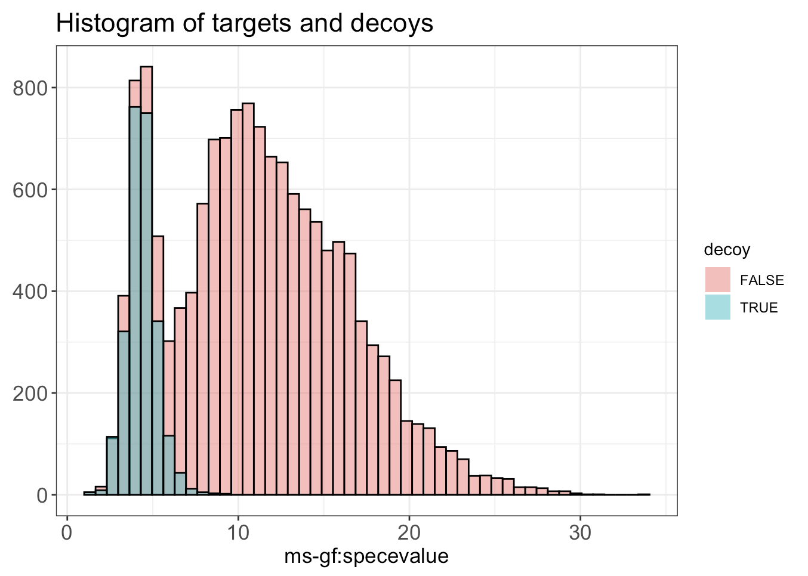
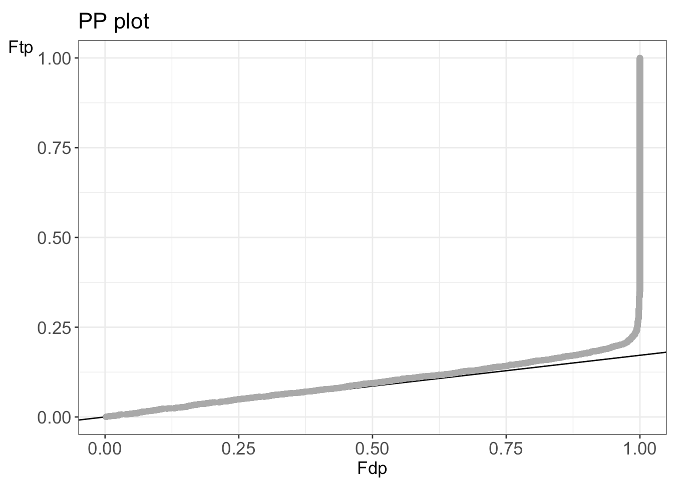

```{r setup, include=FALSE}
library(knitr)
opts_chunk$set(
    collapse = TRUE,
    comment = "#>",
    crop = NULL,
    fig.width = 8
)
```


```{r vignetteSetup, echo=FALSE, message=FALSE, warning = FALSE}
## Track time spent on making the vignette
startTime <- Sys.time()
```

# Basics

## Installing `TargetDecoy`

`r Biocpkg("TargetDecoy")` is an `R` package available via the [Bioconductor](http://bioconductor.org) repository for packages. `R` can be installed on any operating system from [CRAN](https://cran.r-project.org/) after which you can install `r Biocpkg("TargetDecoy")` by using the following commands in your `R` session:

```{r "install", eval=FALSE}
if (!requireNamespace("BiocManager", quietly = TRUE)) {
      install.packages("BiocManager")
  }

BiocManager::install("TargetDecoy")

## Check that you have a valid Bioconductor installation
BiocManager::valid()
```

## Citing `TargetDecoy`

We hope that `r Biocpkg("TargetDecoy")` will be useful for your research. Please use the following information to cite the package and the overall approach. Thank you!

```{r "citation"}
## Citation info
citation("TargetDecoy")
```

# Introduction

A first step in the data analysis of Mass Spectrometry (MS) based proteomics
data is to identify peptides and proteins. With this respect the huge number of
experimental mass spectra typically have to be assigned to theoretical peptides
derived from a sequence database. Search engines are used for this purpose.
These tools compare each of the observed spectra to all candidate theoretical
spectra derived from the sequence data base and calculate a score for each
comparison. The observed spectrum is then assigned to the theoretical peptide
with the best score, which is also referred to as the peptide to spectrum match
(PSM). It is of course crucial for the downstream analysis to evaluate the
quality of these matches. Therefore False Discovery Rate (FDR) control is used
to return a reliable list PSMs. The FDR, however, requires a good
characterisation of the score distribution of PSMs that are matched to the wrong
peptide (bad target hits). In proteomics, the target decoy approach (TDA) is
typically used for this purpose. The TDA method matches the spectra to a
database of real (targets) and nonsense peptides (decoys). A popular approach to
generate these decoys is to reverse the target database. Hence, all the PSMs
that match to a decoy are known to be bad hits and the distribution of their
scores are used to estimate the distribution of the bad scoring target PSMs. A
crucial assumption of the TDA is that the decoy PSM hits have similar properties
as bad target hits so that the decoy PSM scores are a good simulation of the
target PSM scores. Users, however, typically do not evaluate these assumptions.
To this end we developed **TargetDecoy** to generate diagnostic plots to
evaluate the quality of the target decoy method.

# Concepts

## Basic Statistical Concepts

We first introduce some notation. With $x$ we denote the PSM and without loss of
generality we assume that larger score values indicate a better match to the
theoretical spectrum. The scores will follow a mixture distribution:

$$f(x) = \pi_0f_0(x)+(1-\pi_0)f_1(x),$$

with $f(x)$ the target PSM score distribution, $f_0(x)$ the mixture component
corresponding to incorrect PSMs, $f_1(x)$ the mixture component corresponding to
the correct PSMs and $\pi_0$ the fraction of incorrect PSMs. Based on the
mixture distribution we can calculate the posterior probability that a PSM with
score $x$ is a bad match:

$$ P[\text{Bad hit} \mid \text{score }x]=\frac{\pi_0 f_0 (x)}{f(x)}, $$

which is also referred to as the posterior error probability (PEP) in mass
spectrometry based proteomics. With the mixture model, we can also calculate the
posterior probability that a random PSM in the set of all PSMs with scores above
a score threshold t is a bad hit:

$$ P[\text{Bad hit} \mid \text{score }x>t]=\pi_0 \frac{\int\limits_{x=t}^{+\infty} f_0(x)dx}{\int\limits_{x=t}^{+\infty} f(x)dx}, $$

with \(\int\limits_{x=t}^{+\infty} f_0(x) dx \) the probability to observe a bad
PSM hit above the threshold and, \(\int\limits_{x=t}^{+\infty} f(x) dx \) the
probability to observe a target PSM hit above the threshold. The probability \(
P[\text{Bad hit} \mid \text{score }x>t] \) is also referred to as the False
Discovery Rate for peptide identification (FDR) of the set of PSMs with scores
above the threshold $t$. Hence, the FDR has the interpretation of the expected
fraction of bad hits in the set of all target hits that are returned in the
final PSM list, so bad PSM hits with scores above the threshold.

In order to estimate the FDR, we thus have to estimate the distribution of the
bad hits and of the targets. In proteomics this is typically done by the use of
the Target Decoy Approach (TDA).

## Target Decoy Approach

A **competitive** target decoy search involves performing a search on a
concatenated target and decoys database (for example reversed target database).
Typically, one will ensure that there are as many targets as there are decoys.
If the decoy hits are a good simulation of the bad target hits, it is equally
likely that a bad hit will go to the targets or to the decoys. With a
competitive target decoy approach, it is therefore assumed that a bad hit
matches a bad target equally likely as a decoy.

The distribution of bad target hits ($f_0(t)$) and the marginal distribution of
all target hits ($f(t)$) is empirically estimated using the decoys scores and
all target scores respectively. With the TDA, the FDR of the set of returned
PSMs with scores above a threshold t, is estimated by dividing the number of
decoy hits with a score above t by the number of target PSMs with a score above
t.

$$
\widehat{\text{FDR}}(t) = 
  \frac{\#\widehat{\text{ bad hits}} \mid x>t}{\#\text{ targets} \mid x>t} 
  \stackrel{(*)}{=} \frac{\#\text{ decoys} \mid x>t}{\#\text{ targets} \mid x>t} \\
  (*) \text{ Assumption TDA}: \text{bad targets} \stackrel{d}{=} \text{decoys}
$$

This can be rewritten as:

$$\widehat{\text{FDR}}(t)=\frac{\#decoys}{\#targets} \cdot \frac{\frac{\# decoys \mid x>t}{\#decoys}}{\frac{\#targets \mid x>t}{\#targets}}$$

$$\widehat{\text{FDR}}(t) = {\widehat{\pi}}_0 \frac{\widehat{\int\limits_t^{+\infty} f_0(x) dx}}{\widehat{\int\limits_t^{+\infty} f(x)dx}}$$

Hence, the proportion of bad hits $\pi_0$ is estimated as the number of decoys
divided by the number of targets, since the competitive TDA assumes that it is
equally likely that a bad hit matches to a bad target hit or to a decoy. The
probability on a (bad) target PSM hit above the threshold is estimated based on
the empirical cumulative distribution in the sample, i.e. as the fraction of
targets (decoys) that are above the threshold. Hence, a second assumption is
that the decoy scores provide a good simulation of the bad target scores.

```{r, echo=FALSE, fig.cap="Illustration of the target and decoy distributions. In grey the histogram of the target PSM scores."}
include_graphics("img/Grijs_Target.png")
```
```{r, echo=FALSE, fig.cap="The blue bars are the histogram of the decoy PSM scores. We see that the decoy PSMs match well with the incorrect target hits that are more likely to occur at low scores."}

```

In summary, two assumptions have to be checked:
  
- Assumption 1: The decoy PSM hits are a good simulation of the bad target hits
and they distributions are equal.

- Assumption 2: When the library size of targets and decoys is the same, it is
equally likely that a bad hit matches to a target sequence or to a decoy
sequence.

When these two assumptions are met we can replace the number of bad hits by the
number of decoys.

These assumptions can be checked using a histogram and a PP-plot. 

# Generated plots

## Histogram

In the histogram the shape of the decoys (shown in blue in the figure below)
should be equal to that of bad target hits (first mode in the target
distribution indicated in red). The height of the decoys can be slightly lower
than the first mode in the target distribution because some good target hits
also have a low score.

```{r, echo=FALSE}

```

## PPplot

The figure below shows an example of a PP plot, the main diagnostic plot to
evaluate the quality of the decoys.

```{r, echo=FALSE}

```

Deviations from the assumptions of TDA can be best evaluated in the PP-plot. The
PP-plot displays the empirical cumulative distribution (ECDF) from the target
distribution in function that of the decoy distribution. PP-plots have the
property that they show a straight 45 degree line through the origin if and only
if both distributions are equivalent. Any deviation from this straight line
indicates that the distributions differ. For targets and decoys there
distributions will obviously differ. Indeed, the target distribution is
stochastically larger than the decoy distribution as larger scores indicate more
reliable hits and as decoys are believed to behave similarly to bad target hits.
Hence, the PP-plot for targets versus decoys will always lay below the 45 degree
line. When the decoys are a good simulation for the bad target hits, however,
the lower values in the PP-plot should lay on a straight line through the origin
with a slope determined by $\widehat{\pi}_0$. Indeed, small target PSM scores
are most likely bad hits. Hence we will include the $\widehat{\pi}_0$-line in
our diagnostic PP plot to evaluate the quality of the decoys.

When the assumptions of the TDA approach are violated, the dots in the PP-plot
at lower percentiles will deviate from the $\widehat{\pi}_0$ line. In case the
PP-plot is still a straight line at lower percentiles, then the shape of the
decoy distribution is correct, but there are less (or more) decoys than expected
under the concatenated TDA assumption, which could occur if the decoy database
is different in size than the target database or when a bad hit is less likely
to match to a decoy than to a bad target hit. This would also be visible in the
histograms: the decoy histogram would be considerably lower (higher) than the
first mode of the target distribution. When the PP-plot at lower percentiles
deviates from a straight line, the distribution of decoys and the bad target
PSMs is not equivalent, indicating that the decoys are not a good simulation of
bad target hits. Both type of deviations should be of concern as they indicate
that the FDR returned by the conventional concatenated TDA is incorrect.

# Examples

```{r "libraries", message=FALSE, warning=FALSE}
library(TargetDecoy)
library(ggplot2)
library(gridExtra)
```

## The data

In this vignette we use data from a Pyrococcus furiosis sample run on a
LTQ-Orbitrap Velos mass spectrometer. A fasta file was downloaded from
Swissprot. The Pyrococcus dataset was searched against all Pyrococcus proteins
with the MS-GF+ Search engine. The other search was a dataset downloaded on the
same time, but from Uniprot.

## Example 1: One file and one search engine {#example1}

### Example 1.1: MSGF+ search engine

In the next example MS-GF+ was used as the database search engine and SwissProt
was used as protein sequence database. The MS-GF+ search provided an mzid file.

```{r example1.1-data}
## Load the example SwissProt dataset
data("ModSwiss")
```

#### Without GUI 

We use the function `evalTargetDecoys()`. This function creates two diagnostic
plots, i.e. a histogram and a PP plot. It can be used to evaluate the quality of
the target decoy approach, i.e. to check the competitive TDA assumptions.

When the variable name of the decoy flag and the score is known in advance, all
of the following arguments can be passed to the function and no GUI is needed:

- `object`: mzID object, mzR object or `data.frame`
- `decoy`: Name of the decoy variable which consists of a boolean that indicates
if the score belongs to a target or a decoy. Name of the variable 'isdecoy' in
the file (typically `"isdecoy"` or `"isDecoy"`).
- `score`: Score variable contains the scores of the search engine, which have
to be continuous (larger scores are assumed to be better. E-values are typically
-log10(e-value) transformed.) Name of the variable depends on the search engine.
- `log10`: Logical. Should the score be log10 transformed? Typically used when
the score is an e-value.
- `nBins`: Number of bins in the histogram.

```{r}
msgfSwiss <- evalTargetDecoys(ModSwiss,
    decoy = "isdecoy", score = "ms-gf:specevalue",
    log10 = TRUE, nBins = 50
)

## The output is a list containing each plot
names(msgfSwiss)
```

When plotting the object `msgfSwiss` five plots are generated: a histogram and a
zoom of the histogram on the decoys, a PP plot and a zoom of the PP plot and an
outline plot with all four plots. These five plots can each be called
individually as follows:

```{r}
msgfSwiss$ppPlot
msgfSwiss$ppPlotZoom
msgfSwiss$histogram
msgfSwiss$histogramZoom
msgfSwiss$together
```

All plots are `ggplot` objects, which means that one can zoom in on any part of
the plot.

```{r}
zoomPlot <- msgfSwiss$ppPlot +
    coord_cartesian(xlim = c(NA, 0.25), ylim = c(NA, 0.05))
zoomPlot
```

#### With GUI

When we only provide the object with the search results, e.g. imported mzID
files as an argument to the function, a pop-up window opens. The user can select
all the other arguments in the GUI as shown below.

The object argument can consist of three types:

- `mzID` object; Preprocessed file with `mzID::mzID()` before usage in the function.
- `mzR` object; Object of the class `mzR` (mzID file that has been imported in R
through the `r Biocpkg("mzR")` package)
- `data.frame`; Contains fields 'isdecoy' and 'score'

```{r, eval=FALSE}
## Use the function with only an mzID object and no other arguments,
## this will launch a Shiny app to select the relevant arguments
msgfSwiss <- evalTargetDecoys(ModSwiss)
```

<!-- TODO: {width=700px} -->

When executing the `evalTargetDecoys()` function, a histogram and pp-Plot are
generated. Histogram and pp-Plot can be seen in the respective panels of the
GUI, but also in the R session after stopping the application. They are also
returned to the R session when quitting the shiny app.

### Interpretation

The histogram shows that the shape of the distribution of the decoys (shown in
blue) is approximately equal to that of the bad target hits (first mode in the
target distribution indicated in red). The height of the decoys is slightly
lower than the first mode in the target distribution, which is due to the fact
that some good target hits also have a low score. This indicates that the form
is good which is also confirmed in the PP-plot.

Moreover, the first part of the PP-plot is linear with a slope that is about
equal to $\hat{\pi}_0$ line. This indicates that the decoy distribution and the
mixture component for incorrect PSMs of the target mixture distribution (=
distribution of the bad target hits) coincide more or less. This profile in the
PP-plot indicates that the set of decoys from the complete search is
representative for the bad target hits. Hence, the assumptions of the
concatenated TDA approach are not violated for this Pyrococcus example,
assumption 2 is also fulfilled.

Overall we can conclude that in this example the assumptions for the TDA are met.

### Example 1.2: X!Tandem search engine

In the next example, X!Tandem was used as the database search engine and
SwissProt was used as protein sequence database. The X!Tandem search provided an
mzid file.

```{r}
## Load X!Tandem example data
data("ModSwissXT")
```

We run `evalTargetDecoys()` with the necessary arguments.

```{r}
msgfSwissXT <- evalTargetDecoys(ModSwissXT,
    decoy = "isdecoy", score = "x!tandem:expect",
    log10 = TRUE, nBins = 50
)
msgfSwissXT$together
```

The shape of the decoy distribution seems to be fine, i.e. the first part of the
PP-plot lies on a straight line. But, the histogram and the PP-plot show issues
with the estimation of pi0. The total number of decoys does not seem to be a
good estimate for the total number of bad target PSM hits. Indeed, it seems to
be more likely that a bad match is a target than a decoy! This is due to the two
pass search strategy that is performed by X!tandem. In the first phase a rapid
search is performed, which does not allow for modifications nor for miss
cleavages. In a second phase, a new search is conducted solely against the
identified peptides in the first phase, but now by using a more complex strategy
that allows for missed cleavages and post translational modifications.
Performing the refined search against the smaller population of candidate
peptides from the first phase greatly reduces the computational complexity,
however, it comes at the cost that the TDA assumptions are violated. Indeed, in
the second pass low scoring PSMs can switch to a modified PSM, which seems to be
the case for many decoy hits from the first phase. Many of these switched
modified target PSMs, however, remain to have a relative low score and are
likely to be bad target PSMs. The number of decoy matches is no longer
representative for the number of bad target matches. This example shows that the
use of a second pass strategy can be very detrimental for the FDR estimation
using the TDA approach.

## Example 2: One file and search performed by an engine that combines different search engines {#example2}

In the following example multiple database search engines where used to process
the same mzID file and both Swissprot and Uniprot were used as protein sequence
database. Three search engines -- MS-GF+, OMSSA and X!Tandem -- and a
combination of these 3 (by using PeptideShaker) were used to search against both
protein sequence databases. `createPPlotScores()` provides the possibility to
evaluate each of the sub-engines and the overall itself. Two PP plots are
created to evaluate the quality of the TDA.

Provide following arguments in the function. When one are more are missing, also
here a GUI pops up.

- `object`: mzID object, mzR object or `data.frame`
- `decoy`: Name of the decoy variable which consists of a boolean that indicates
if the score belongs to a target or a decoy. Name of the variable 'isdecoy' in
the file (typically `"isdecoy"` or `"isDecoy"`).
- `scores`: Character vector indicating the score variables containing the
scores of the search engine. Name of the variable depends on the search engine.
- `log10`: Logical. Should the score be log10 transformed? Typically used when
the score is an e-value.

In the next example MSGF+ was used as the database search engine and SwissProt
was used as protein sequence database. The MSGF+ search provided an mzid file.

```{r, fig.asp=1}
## Load the example data
data("pyroSwissprot")

## Run createPPlotScores with necessary arguments
## Omitting 'decoy', 'scores' or 'log10' will launch the Shiny app
plotsShakerSwiss <- createPPlotScores(pyroSwissprot,
    decoy = "isdecoy",
    scores = c("omssa:evalue", "ms-gf:specevalue",
               "x!tandem:expect", "peptideshaker psm score"),
    ## We can choose to log-transform some scores but not others
    log10 = c(TRUE, TRUE, TRUE, FALSE)
)

grid.arrange(plotsShakerSwiss[[1]], plotsShakerSwiss[[2]], nrow = 2)
```

### Interpretation of the plots

For files with results for multiple search engines, a “standardized” PP-plot is
also included. In this plot the estimated $\pi_0$ is removed from the PP-plot.
In the standardized PP-plot deviations in the first part have to be compared to
the 0 line, which allows the user to quickly spot issues when the results of
multiple search engines is visualised. The standardized plots show that the TDA
assumptions hold for both MSGF+ and OMSSA. For X!tandem, however, we again see
issues for the Swissprot search and these also seem to affect the combined
peptide shaker search engine score that relies on all three searches.

<!-- MM: the text below relates to another example not shown -->
<!-- In the Uniprot search, however, no -->
<!-- clear deviations are observed. Indeed, Uniprot is a much larger database than -->
<!-- the curated Swissprot database. Therefore the search space in X!tandems first -->
<!-- phase is much larger for Uniprot than for Swissprot. Hence, less decoys from the -->
<!-- first pass seem to match with a higher score to a modified target PSMs in the -->
<!-- second pass and the FDR estimation does not seem to be compromised. -->

From these plots we can deduce that combined search engines are useful. However,
it is crucial to assess the TDA assumptions, otherwise the FDR control can be
dramatically compromised and our tool can help data analysts to choose the
engines that they include in combined search engines, carefully.

## Example 3: Check the assumptions for multiple searches/runs {#example3} 

When you have to evaluate the quality of the TDA for different runs, it can be
useful to see at a glance which runs have problems with these assumptions. The
function `createPPlotObjects()` provides the possibility to process multiple files
all in once and two PP plots are created to check the necessary assumptions. A
first plot with the original PP plots and pi0 lines. A second "standardized"
plot where the reference pi0 line is at 0. An overview in one figure ensures a
quick evaluation of a large number of files. Based on this plot a more detailed
analysis of the 'anomalous' runs can be done with `evalTargetDecoys()`.

The function `createPPlotObjects()` has four arguments:

- `object_list`: a list of mzID, mzR or `data.frame` objects.
- `decoy`: Name of the decoy variable which consists of a boolean that indicates
if the score belongs to a target or a decoy. Name of the variable 'isdecoy' in
the file (typically `"isdecoy"` or `"isDecoy"`).
- `score`: Character vector indicating the score variables containing the
scores of the search engine. Name of the variable depends on the search engine.
- `log10`: Logical. Should the score be log10 transformed? Typically used when
the score is an e-value.

Again, when all of these arguments are given correctly, the function will be
executed and the desired plots will be created. However, if the user forgets to
provide one of the arguments, or gives an incorrect variable that does not
belong to the desired class, a shiny app is launched to select the varaibles for
each input object given in `object_list`.

### Provide a list with all objects 

We will reuse the data sets from the previous examples and store them in a list.

### Example 3.1: Two data sets with the same search engine

In this example scores come from the same search engine, MS-GF+, and thus are
indicated by the same variable name `"ms-gf:specevalue"`.

```{r, fig.asp=1}
## Create list of input objects, list names will be reused in the plots
mzObjects <- list(
    ModSwiss_data = ModSwiss,
    pyroSwissprot_data = pyroSwissprot
)

plotSameEngine <- createPPlotObjects(
    mzObjects, decoy = "isdecoy",
    score = "ms-gf:specevalue"
)

grid.arrange(plotSameEngine[[1]], plotSameEngine[[2]], nrow = 2)
```

### Example 3.2: Two objects with different search engines

In this last example, different variable names for score are given as a vector,
because two different search engines, MS-GF+ and X!tandem, were used.

```{r, fig.asp=1}
## Create list of input objects, list names will be reused in the plots
mzObjects <- list(
    ModSwiss_data = ModSwiss,
    ModSwissXT_data = ModSwissXT
)

plotDiffEngine <- createPPlotObjects(mzObjects,
    decoy = "isdecoy",
    score = c("ms-gf:specevalue", "x!tandem:expect")
)

grid.arrange(plotDiffEngine[[1]], plotDiffEngine[[2]], nrow = 2)
```

Also here, it can be useful to zoom in on one specific part of the figure.

```{r}
# Zoom in on the relevant or desired part of the plot
plotZoom <- plotDiffEngine[[2]] +
    coord_cartesian(xlim = c(NA, 0.25), ylim = c(NA, 0.05))
plotZoom 
```

In a final step, we can investigate the anomalous plot in more detail using
`evalTargetDecoys()`.

```{r}
detailPlot <- evalTargetDecoys(mzObjects$ModSwissXT_data,
    decoy = "isdecoy", score = "x!tandem:expect",
    log10 = TRUE, nBins = 50
)

detailPlot$together
```

# Reproducibility

Date the vignette was generated.

```{r reproduce1, echo=FALSE}
## Date the vignette was generated
Sys.time()
```

Wallclock time spent generating the vignette.

```{r reproduce2, echo=FALSE}
## Processing time in seconds
totalTime <- diff(c(startTime, Sys.time()))
round(totalTime, digits = 3)
```

<details>
<summary>`R` session information.</summary>

```{r reproduce3, echo=FALSE}
options(width = 120)
sessioninfo::session_info()
```

</details>
